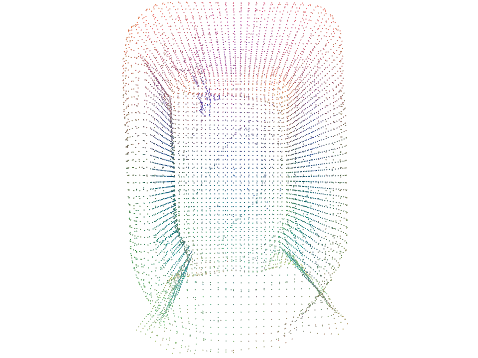
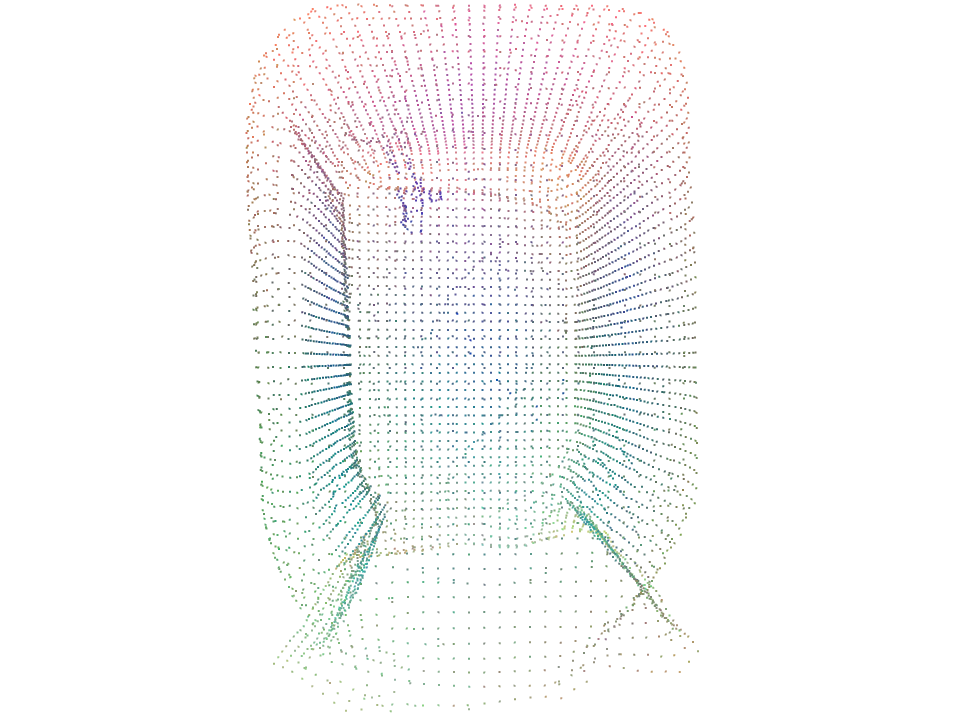
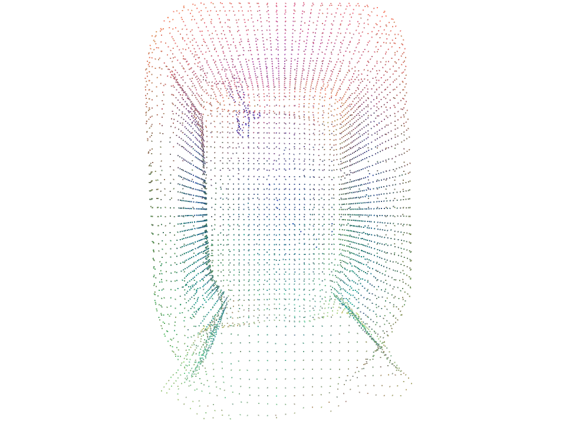
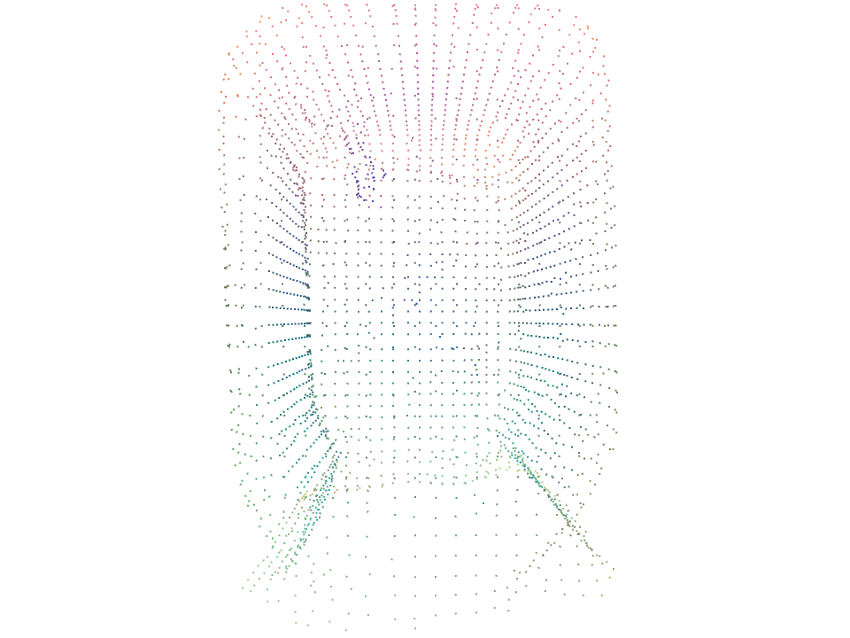

# GeDi Setup Guide (Working Configuration for RTX 4090 + CUDA 12.6)

This document records a verified working setup of
**GeDi – Learning General and Distinctive 3D Local Descriptors**
under modern Linux (Pop!_OS / Ubuntu 22+) using `uv`, Python 3.8, and PyTorch 1.8.1.

---

## Environment Summary

| Component     | Version / Build                                   |
| ------------- | ------------------------------------------------- |
| Python        | 3.8.13                                            |
| CUDA Toolkit  | 12.6 (system)                                     |
| PyTorch       | 1.8.1 + cu111                                     |
| Open3D        | 0.15.1 (custom wheel for torch 1.8.1)             |
| torchgeometry | 0.1.2                                             |
| GPU           | NVIDIA GeForce RTX 4090 (sm 89 compiled as sm 86) |
| OS            | Linux x86_64 (Pop!_OS / Ubuntu)                   |

---

## 1. Create and activate environment

```bash
uv venv --python 3.8
source .venv/bin/activate
```

---

## 2. Install PyTorch 1.8.1 (CUDA 11.1 build)

Download the correct wheel and install:

```bash
uv pip install ./torch-1.8.1-cp38-cp38-linux_x86_64.whl
```

---

## 3. Install dependencies

```bash
uv pip install \
    torchgeometry==0.1.2 \
    gdown \
    tensorboard \
    protobuf==3.20
```

---

## 4. Install the correct Open3D 0.15.1 + torch1.8.1 wheel

Download from
[https://github.com/isl-org/open3d_downloads/releases/tag/torch1.8.1](https://github.com/isl-org/open3d_downloads/releases/tag/torch1.8.1)

File to use for Linux x86_64 and Python 3.8:

```
open3d-0.15.1-cp38-cp38-manylinux_2_27_x86_64.whl
```

Install it:

```bash
uv pip install ./open3d-0.15.1-cp38-cp38-manylinux_2_27_x86_64.whl
```

---

## 5. Build PointNet2 Ops

Navigate to:

```bash
cd backbones/pointnet2_ops_lib
```

Edit `setup.py` and replace this line:

```python
os.environ["TORCH_CUDA_ARCH_LIST"] = "3.7+PTX;5.0;6.0;6.1;6.2;7.0;7.5"
```

with:

```python
os.environ["TORCH_CUDA_ARCH_LIST"] = "8.6"
```

Then build:

```bash
rm -rf build
uv pip install --no-build-isolation .
```

Verify:

```bash
python -c "import pointnet2_ops; print('PointNet2 built successfully')"
```

---

## 6. Download pretrained model and demo data

From project root:

```bash
python download_data.py
```

If using uv isolation:

```bash
uv sync && uv run python download_data.py
```

---

## 7. Run demo

```bash
python demo.py
```

Expected output:

* Open3D windows or images showing before and after registration.
* The pretrained model automatically loads from downloaded assets.

---

## Notes

* RTX 4090 (sm 89) runs kernels compiled for sm 86; CUDA driver recompiles automatically.
* Do not upgrade Open3D above 0.15.1 or PyTorch above 1.8.1.
* Keep the wheels cached locally for reproducibility.
* For multiple projects with conflicting requirements, create separate `uv venv`s.

---

## Quick rebuild summary

```bash
uv venv --python 3.8
source .venv/bin/activate
uv pip install ./torch-1.8.1-cp38-cp38-linux_x86_64.whl
uv pip install ./open3d-0.15.1-cp38-cp38-manylinux_2_27_x86_64.whl
uv pip install torchgeometry==0.1.2 gdown tensorboard protobuf==3.20
cd backbones/pointnet2_ops_lib
# edit setup.py → os.environ["TORCH_CUDA_ARCH_LIST"] = "8.6"
uv pip install --no-build-isolation .
cd ../..
python download_data.py
python demo.py
```

# Notes on GeDi

## GeDi Descriptor Experiments (LMO Dataset)

This section documents the **`gedi_experiments_lmo.py`** script suite.  
These experiments benchmark and visualize the **GeDi geometric descriptor** performance under different point cloud resolutions using the **LineMOD (LMO)** 20 Objects dataset.

---

### File: `GeDi/gedi_experiments_lmo.py`

**Purpose:**  
Run controlled experiments on a single 3D object from the dataset (e.g., `Kinfu_Audiobox1_light/object.xyz`)  
to measure how **GeDi inference time**, **feature density**, and **visual descriptor structure** vary with downsampling.

---

### Configuration Summary

| Variable | Description |
|-----------|--------------|
| `MODE` | `"single"` → visualize one level interactively<br>`"all"` → generate PNGs for all levels headlessly |
| `SINGLE_LEVEL` | Select which level to visualize when in `"single"` mode |
| `path` | Input 3D model path (e.g., `data/20objects/data/Kinfu_Audiobox1_light/object.xyz`) |
| `output_dir` | Folder where results will be saved (default: `outputs/gedi_experiments/`) |
| `sampling_levels` | Defines voxel downsample sizes for five resolutions:<br>**high_50k** (full), **medium_25k**, **low_12k**, **lower_6k**, **tiny_3k** |
| `fchkpt_gedi_net` | Path to pretrained checkpoint (e.g., `data/chkpts/3dmatch/chkpt.tar`) |

---

### What It Does

Depending on the mode:

#### 1. `MODE = "single"`
- Loads one resolution level (e.g., `"medium_25k"`)
- Runs GeDi on GPU
- Projects 32D descriptors → RGB via PCA
- Opens an **interactive Open3D viewer**

#### 2. `MODE = "all"`
- Loops through all five sampling levels
- Runs GeDi for each
- Renders and **saves PNG snapshots** (`.png`) of colored descriptors
- Logs metadata (point count, timing, file paths) in a CSV

---

### CSV Log Example

| Level | Points | Time (ms) | PNG File |
|--------|---------|------------|-----------|
| high_50k | 50407 | 35167.8 | `outputs/gedi_experiments/high_50k.png` |
| medium_25k | 7179 | 1647.3 | `outputs/gedi_experiments/medium_25k.png` |
| low_12k | 6263 | 1414.6 | `outputs/gedi_experiments/low_12k.png` |
| lower_6k | 3068 | 587.4 | `outputs/gedi_experiments/lower_6k.png` |
| tiny_3k | 1466 | 247.7 | `outputs/gedi_experiments/tiny_3k.png` |

---

### Example Visual Results

| Density Level | Visualization |
|----------------|----------------|
| **High (50k)** |  |
| **Medium (25k)** |  |
| **Low (12k)** |  |
| **Lower (6k)** |  |
| **Tiny (3k)** |  |

> Each image shows how descriptor distinctiveness changes with geometric resolution.

---

### Usage Examples

#### **To visualize one configuration interactively:**
```bash
# Edit script
MODE = "single"
SINGLE_LEVEL = "medium_25k"
```
# Run
```
python gedi_experiments_lmo.py
```
