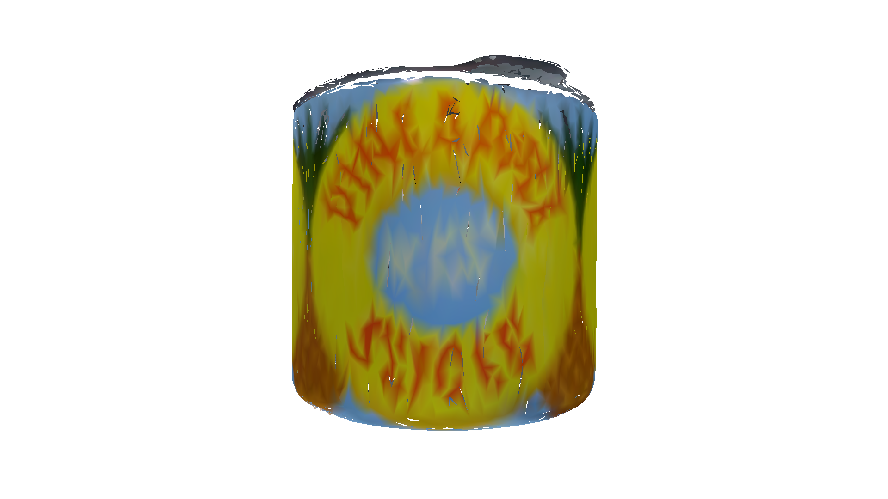
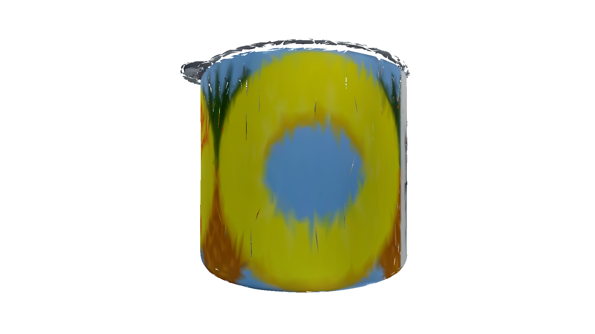
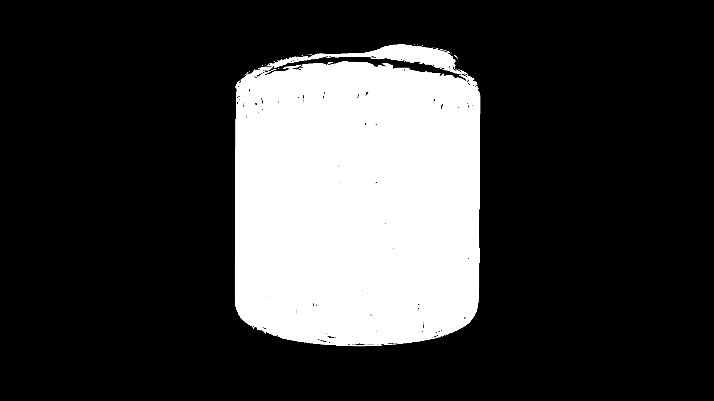
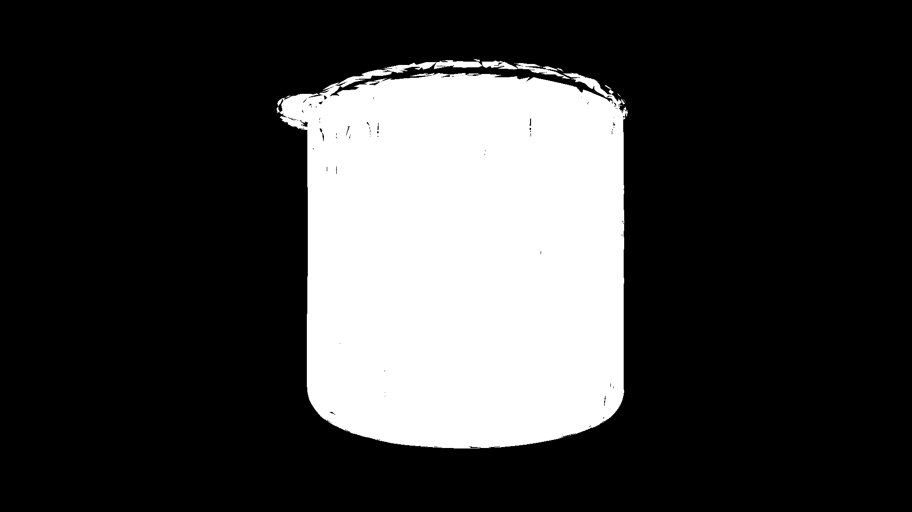
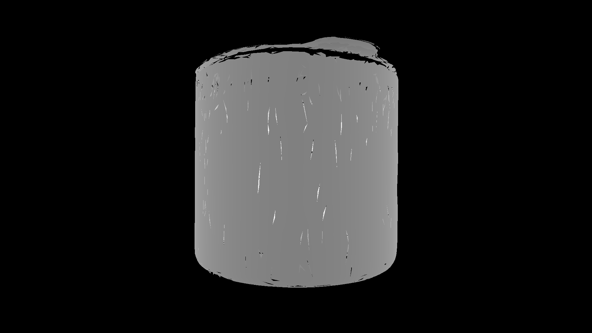

# freeze-pipeline: Reproducing and Profiling the FreeZe Pipeline

**freeze-pipeline** is an independent reproduction and experimental implementation of the **FreeZe** pipeline — *Training-Free Zero-Shot 6D Object Pose Estimation using Foundation Models*.
The project focuses on **understanding, modularizing, and benchmarking** each stage of FreeZe, beginning with the **GeDi geometric foundation model**.
Unlike model-free approaches, FreeZe relies on **3D model–based zero-shot registration** using pretrained geometric and visual encoders (GeDi + DINOv2), without any task-specific training.

The goal of this repo is to:
- Run **GeDi** inference in real-time on standard object datasets (e.g., LM-O, YCB-V),
- Integrate **DINOv2** visual features and perform 3D–3D registration,
- Assemble the **end-to-end FreeZe pipeline**, from feature extraction to pose refinement,
- Optimize and profile components (e.g., distilling GeDi → *dGeDi*).

---

## Overview

FreeZe estimates the 6D pose of a known 3D object in a scene **without training**. The process is divided into two main stages:

1.  **Query Object Processing (Offline Preparation)**
    This stage runs once per object to generate a detailed feature representation.
    -   **Geometric Features:** The object's 3D point cloud is processed by **GeDi** to produce shape-aware descriptors for each point.
    -   **Visual Features:** The object's 3D model is rendered from multiple viewpoints. **DINOv2** extracts dense visual features from each view, which are then back-projected and aggregated onto the 3D point cloud.
  

| Front View | Right View |
| :---: | :---: |
| **RGB Render** | **RGB Render** |
|  |  |
| **Segmentation Mask** | **Segmentation Mask** |
|  |  |
| **Depth Map** | **Depth Map** |
|  |  |

2.  **Target Scene Processing (Online Localization)**
    This stage runs on a new scene image to find the object of interest.
    -   **Localization:** The **SAM2 (Segment Anything Model 2)** is used to generate multiple high-quality segmentation masks (proposals) for potential objects in the target image.
    -   **Zero-Shot Matching:** For each proposal mask, DINOv2 extracts its visual features. These features are compared against the stored query object's features using **cosine similarity**. The proposal with the highest similarity score is identified as the target object.

The final steps, which are not yet implemented, would involve using these correspondences for pose estimation (RANSAC) and refinement (ICP).

---

## High-Level Checklist

| Stage | Description | Status |
| :--- | :--- | :--- |
| **GeDi Integration** | Build, test, and benchmark GeDi on RTX 4090 | ✅ Done |
| **Query Feature Extraction** | Extract GeDi and multi-view DINOv2 features | ✅ Done |
| **Feature Back-Projection** | Aggregate multi-view 2D visual features onto 3D model | ✅ Done |
| **Target Scene Segmentation** | Localize object proposals using SAM2 | ✅ Done |
| **Zero-Shot Matching** | Rank proposals by feature similarity to query object | ✅ Done |
| **Feature Fusion** | Combine geometric and visual features | ⬜ To-Do |
| **Pose Estimation (RANSAC)** | Estimate coarse pose from 3D-3D feature matches | ⬜ To-Do |
| **Pose Refinement (ICP)** | Refine pose using ICP and symmetry-aware methods | ⬜ To-Do |

---

## Structure

The pipeline uses three fully isolated Python environments to manage dependencies.

`gedi_env` – GeDi inference and geometric processing.
`dino_env` – DINOv2 inference for visual features.
`sam2_env` – SAM2 for object segmentation in the target scene.

The main controller in `integration/` orchestrates calls to these environments.

```
freeze-pipeline/
│
├── integration/
│   └── run_pipeline.py         # Main controller to run pipeline stages
│
├── gedi/
│   ├── .venv/                  # GeDi environment
│   ├── 1_gedi_process_object.py  # Extracts GeDi features and renders views
│   └── 2_backproject_features.py # Aggregates multi-view features
│
├── dino/
│   ├── .venv/                  # DINOv2 environment
│   └── demo_infer.py           # Extracts dense features for a masked image
│
├── sam2/
│   ├── .venv/                  # SAM2 environment
│   ├── 3_sam2_localization.py    # Generates object proposals from a target image
│   └── 4_match_proposals.py      # Ranks proposals by matching against query features
│
├── data/
│   └── ...                     # Input object models and target scenes
│
└── processed/                  # All output is saved here
    ├── query/
    │   ├── <object>_pc.ply
    │   ├── <object>_gedi.npy
    │   └── <object>_visual_features.npy
    └── target/
        ├── <image>_mask_00.png
        └── <image>_ranked_matches.npy
```

---

## Usage

The main pipeline script `integration/run_pipeline.py` uses a command-line interface to execute the different stages.

#### 1. Stage 1: Process a Query Object

This command processes a 3D object model to extract and save its geometric and visual features.

```bash
python integration/run_pipeline.py --stage query \
  --query-folder /path/to/your/object/folder \
  --query-output ./processed/query_object
```

#### 2. Stage 2: Localize the Object in a Target Scene

This command takes a target image, finds object proposals using SAM2, and matches them against the features of the previously processed query object.

```bash
python integration/run_pipeline.py --stage target \
  --target-image /path/to/your/scene.jpg \
  --target-output ./processed/target_scene \
  --query-output ./processed/query_object # Must point to results from Stage 1
```

#### 3. Run Both Stages Sequentially

You can run the entire pipeline for a given query object and target scene with a single command.

```bash
python integration/run_pipeline.py --stage both \
  --query-folder /path/to/your/object/folder \
  --target-image /path/to/your/scene.jpg \
  --query-output ./processed/query_object \
  --target-output ./processed/target_scene
```

---

## References

```bibtex
@inproceedings{Poiesi2021,
  title   = {Learning general and distinctive 3D local deep descriptors for point cloud registration},
  author  = {Poiesi, Fabio and Boscaini, Davide},
  booktitle = {IEEE Transactions on Pattern Analysis and Machine Intelligence},
  year    = {(early access) 2022}
}

@article{Caraffa2023FreeZe,
  title   = {FreeZe: Training-free zero-shot 6D pose estimation with geometric and vision foundation models},
  author  = {Andrea Caraffa and Davide Boscaini and Amir Hamza and Fabio Poiesi},
  journal = {arXiv:2312.00947},
  year    = {2023}
}
```
